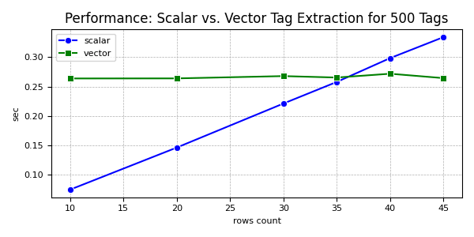

# TagHound

TagHound is a Python library designed to manage and evaluate tag rules based on scalar and vector operations. It supports loading rules from YAML and JSON files, making it easy to integrate into various data processing workflows.

## Table of Contents
- [TagHound](#taghound)
  - [Table of Contents](#table-of-contents)
  - [Installation](#installation)
  - [Usage](#usage)
    - [Creating Tag Rules](#creating-tag-rules)
      - [Loading from YAML](#loading-from-yaml)
    - [YAML File Structure](#yaml-file-structure)
      - [Loading from JSON](#loading-from-json)
      - [Programmatic Creation](#programmatic-creation)
    - [Finding Tags](#finding-tags)
    - [Using Vectorized Operations](#using-vectorized-operations)
  - [Examples](#examples)
  - [License](#license)

## Installation

You can install TagHound using `pip`:

```bash
pip install taghound
```

OR

```bash
pip install https://github.com/rzagreb/TagHound.git
```

## Usage

### Creating Tag Rules

Tag rules can be created programmatically or loaded from YAML or JSON files.

#### Loading from YAML

```python
from taghound import TagHound

taghound = TagHound.rules_from_yaml("path/to/rules.yml")
```

### YAML File Structure

```yaml
# Simple example
- id: plants/flower/regex_rule
  and:
    - key: color
      op: "~" # "~" means regex_match
      value: red|yellow|blue  # regex will be escaped with (?<!\w)(?:...)(?!\w)

# Multiple conditions
- id: plants/tree/nested_rule  # (requried) unique identifier
  label: Complex Tree Rule  #  (optional) Label for the rule. Default: same as `id`
  weight: 12  # (optional) weight assigned to the tag. Default: 0
  and:
    - key: type
      # op: "="   # "=" by default
      value: tree
    - or:
        - key: height
          op: ">"
          value: 20
        - key: location
          op: "~"
          value: "tropical"
 
# Possible comparison operators: 
# "=": equal (int, float, str, bool). This is default operator
# "!=": not equal (int, float, str, bool)
# ">": greater than (int, float)
# "<": less than (int, float)
# ">=": greater than or equal (int, float)
# "<=": less than or equal (int, float)
# "in": in list (list)
# "not_in": not in list (list)
# "~": regex match (str, list[str])
# "!~": regex not match (str, list[str])
```

#### Loading from JSON

```python
from src.taghound import TagHound

taghound = TagHound.rules_from_json("path/to/rules.json")
```

File structure in JSON mimicks yaml

#### Programmatic Creation

```python
from taghound.models import TagRule
from taghound import TagHound

rules = [
    TagRule(
        id="python_rule",
        label="Python",
        weight=10,
        required_fields={"language", "year"},
        scalar_check=lambda d: d["language"] == "python" and d["year"] > 1990
    )
]

taghound = TagHound(rules=rules)
```

### Finding Tags

To find tags in a given data dictionary:

```python
data = {
    "language": "python",
    "year": 1991,
    "version": "3.10"
}

tags = taghound.find_all_tags(data)
print(tags)
```

### Using Vectorized Operations

For larger datasets (>35 items), vectorized operations can be used for better performance:

```python
import pandas as pd
from taghound import TagHound

data = pd.DataFrame([
    {"language": "python", "year": 1991, "version": "3.10"},
    {"language": "java", "year": 1995, "version": "11"}
])

tagged_data = taghound.find_tags_using_vector(data, output_format="list")
print(tagged_data)
```



## Examples

Check the `examples` directory for more examples.

## License

This project is licensed under the MIT License. See the [LICENSE](LICENSE) file for details.
